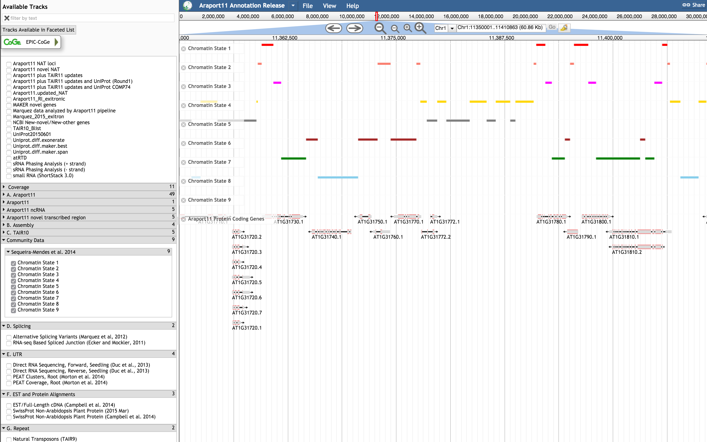

Chromatin States to JBrowse web services
===

**Objective**: Build a simple web service which parses standalone GFF3 files containing high-resolution maps of chromatin states based on DNA and epigenetic data, and returns this data in JBrowse compatible JSON format.

The adapter utilizes [gffutils](http://pythonhosted.org/gffutils/contents.html) to process the input GFF3 file, creating an intermediary sqlite database for fast data retrieval.

**Reference**:  
Joana Sequeira-Mendes, Irene Aragüez, Ramón Peiró, Raul Mendez-Giraldez, Xiaoyu Zhang, Steven E. Jacobsen, Ugo Bastolla, and Crisanto Gutierrez (2014) **The Functional Topography of the Arabidopsis Genome Is Organized in a Reduced Number of Linear Motifs of Chromatin States**. *Plant Cell*, Advance Publication June 2014, doi:[10.1105/tpc.114.124578](http://www.plantcell.org/content/early/2014/06/11/tpc.114.124578)

**Requirements**:
* Enable the following plugin in JBrowse within `tracks.conf`:
  * [Araport REST](https://github.com/Arabidopsis-Information-Portal/jbrowse/blob/stable/plugins/Araport/js/Store/SeqFeature/REST.js) with bindings to ADAMA
```
[plugins]
Araport.location = ./plugins/Araport
```

* This adapter relies on storing the GFF3 file(s) correspoding to the 9 chromatin states within the repository in the `data/` sub-directory.
```
data/tpc124578_SupplementalDS2-state_1.gff3
data/tpc124578_SupplementalDS2-state_2.gff3
data/tpc124578_SupplementalDS2-state_3.gff3
data/tpc124578_SupplementalDS2-state_4.gff3
data/tpc124578_SupplementalDS2-state_5.gff3
data/tpc124578_SupplementalDS2-state_6.gff3
data/tpc124578_SupplementalDS2-state_7.gff3
data/tpc124578_SupplementalDS2-state_8.gff3
data/tpc124578_SupplementalDS2-state_9.gff3
```
* Ensure that the [chromatin_states_to_jbrowse](https://github.com/Arabidopsis-Information-Portal/chromatin_state_to_jbrowse) adapter is registered and accessible via ADAMA. See [metadata.yml](metadata.yml) for adapter configuration (list of dependency modules and REST endpoints described using swagger.io spec).

* Set up the following track configuration in JBrowse within `trackList.json`:
```
{
    "style": {
        "color": "red"
    },
    "key": "Chromatin State 1",
    "storeClass": "Araport/Store/SeqFeature/REST",
    "baseUrl": "https://api.araport.org/community/v0.3/vivek-dev/chromatin_states_to_jbrowse_v0.1",
    "compress": 0,
    "type": "JBrowse/View/Track/CanvasFeatures",
    "category": "Community Data / Sequeira-Mendes et al. 2014"
    "metadata": {
        "Description": "High-resolution map of chromatin state 1, characterized by high amounts of H3K4me2 and H3K4me3, H3 acetylation, H3K36me3, and H2Bub, typically associated with transcribed regions",
        "Source": "Sequeira-Mendes, et al. 2014 (Plant Cell)",
        "URL": "http://www.plantcell.org/content/early/2014/06/11/tpc.114.124578"
    },
    "glyph": "JBrowse/View/FeatureGlyph/Box",
    "label": "chromatin_state_1",
    "query": {
        "chromatin_state": 1
    }
}
```
Repeat the above configuration stanza for the rest of the chromatin states (2-9), altering the following key-value pairs in the config:
  * `key`
  * `label`
  * `query -> chromatin_state`.
  * `metadata -> Description`
  * `style -> color`

**Demo**:



Above screenshot shows the color-coded chromatin domain annotations over an ~50-kb region of the Arabidopsis Chromosome 1 (Chr1:11350001..11410863) being rendered in JBrowse
